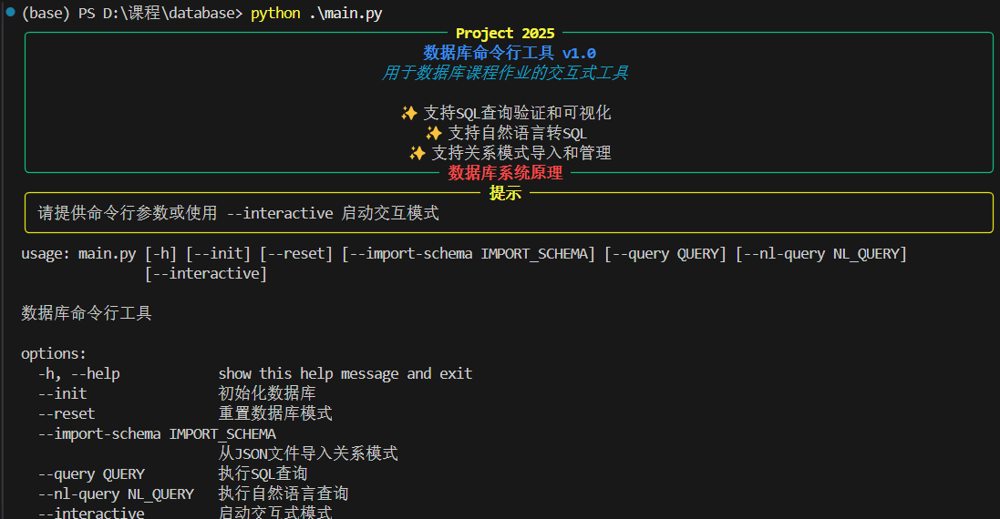

# 数据库课程学习记录

这是我大二下学期数据库课程的学习记录，记录了每周的主题、收获和反思，夹杂着我的心情和思考。从在VSCode配置PostgreSQL开始，这段旅程让我从零基础到能设计数据库，过程充满挑战和成就感。以下是详细记录，带点我的吐槽和感悟。

---

## 第一周：VSCode中配置PostgreSQL

- **主题**：PostgreSQL安装与VSCode集成
- **学习内容**：
  - 下载并安装PostgreSQL
  - 在VSCode中安装SQLTools和Database扩展
  - 配置数据库连接
- **收获**：
  - 搞定了PostgreSQL的安装和服务器配置
  - 用SQLTools在VSCode里连上了数据库
  - 跑了第一条SQL命令，确认连接：
    ```sql
    SELECT version();
    ```
- **反思**：
  - 端口冲突和IP设置让我抓狂，改了`postgresql.conf`才解决
  - VSCode的集成真香，省了好多麻烦
- **注意事项**：
  - 确保防火墙允许PostgreSQL的默认端口（5432）
  - 记得保存好数据库的admin密码，别注册完就忘得干干净净

---

## 第二周：关系模型

- **主题**：关系模型基础
- **学习内容**：
  - 关系模型的核心概念
  - 表、元组和属性的定义
  - 关系模型的优点
- **收获**：
  - 明白了关系模型是基于表的结构化数据管理
  - 表（relation）由元组（rows）和属性（columns）组成
  - 示例：一个简单的学生关系表：
    ```sql
    CREATE TABLE Students (
        student_id INT,
        name VARCHAR(50),
        age INT
    );
    ```
- **反思**：
  - 关系模型简单又优雅，感觉像数学公式一样严谨
  - 刚开始有点晕，元组和行的概念傻傻分不清
- **注意事项**：
  - 表设计时要考虑属性是否允许为空
  - 理解术语（relation、tuple、attribute）对后续学习很重要

---

## 第三周：查询语言与基本数据类型

- **主题**：SQL查询语言与数据类型
- **学习内容**：
  - SQL的基本查询语法
  - 常见数据类型（INT, VARCHAR, DATE等）
  - 数据类型的选择
- **收获**：
  - 学会了用`SELECT`查询数据，例如：
    ```sql
    SELECT name, age 
    FROM Students 
    WHERE age >= 20;
    ```
  - 了解了数据类型，如`VARCHAR(50)`用于字符串，`INT`用于整数
  - 示例：创建带数据类型的表：
    ```sql
    CREATE TABLE Books (
        book_id INT,
        title VARCHAR(100),
        publish_date DATE
    );
    ```
- **反思**：
  - 数据类型选择让我纠结，比如VARCHAR长度设多少合适？
  - 查询语句跑出结果那一刻，感觉自己有点东西
- **注意事项**：
  - 选择数据类型时要考虑数据范围和存储效率
  - WHERE条件的逻辑要清晰，注意运算符优先级

---

## 第四周：模糊查询、转义与集合操作

- **主题**：高级查询技术
- **学习内容**：
  - 使用LIKE进行模糊查询
  - 转义字符处理
  - 集合操作（UNION, INTERSECT）
- **收获**：
  - 掌握了模糊查询，例如：
    ```sql
    SELECT product_name 
    FROM Products 
    WHERE product_name LIKE '%phone%';
    ```
  - 学会了转义特殊字符：
    ```sql
    SELECT name 
    FROM Items 
    WHERE description LIKE '100\% off';
    ```
  - 使用集合操作合并查询结果：
    ```sql
    SELECT student_id FROM Enrolled_2023
    UNION
    SELECT student_id FROM Enrolled_2024;
    ```
- **反思**：
  - 模糊查询好玩，但转义字符让我头大
  - 集合操作感觉像数学里的并集交集，挺直观
- **注意事项**：
  - LIKE查询对大小写敏感，需注意数据库配置
  - 集合操作要求SELECT的列数和类型一致

---

## 第五周：空值操作与聚合查询

- **主题**：空值、聚合与子查询
- **学习内容**：
  - 空值（NULL）与UNKNOWN的区别
  - 聚合函数（COUNT, SUM, AVG）
  - 嵌套子查询
- **收获**：
  - 理解了NULL表示“未知”，UNKNOWN是三值逻辑的结果
  - 使用聚合函数汇总数据：
    ```sql
    SELECT department, COUNT(*), AVG(salary)
    FROM Employees
    GROUP BY department;
    ```
  - 写了一个嵌套子查询：
    ```sql
    SELECT name 
    FROM Students 
    WHERE score > (SELECT AVG(score) FROM Students);
    ```
- **反思**：
  - NULL和UNKNOWN的逻辑绕晕我了，得多练多理解
  - 子查询嵌套写起来爽，有点像编程里的递归
- **注意事项**：
  - NULL在比较时要用`IS NULL`而非`= NULL`
  - 子查询可能影响性能，需优化复杂查询

---

## 第六周：数据库修改与排名

- **主题**：数据修改与排名函数
- **学习内容**：
  - 数据插入、更新、删除
  - 使用RANK进行排名
- **收获**：
  - 学会了修改数据，例如：
    ```sql
    UPDATE Students 
    SET grade = grade + 5 
    WHERE score < 60;
    ```
  - 使用RANK排名：
    ```sql
    SELECT name, score, 
           RANK() OVER (ORDER BY score DESC) AS rank
    FROM Students;
    ```
- **反思**：
  - 修改操作简单但危险，差点把数据搞乱，幸好我会CTRL+Z
  - RANK函数排名后，看着很整齐，便于更好获得某些信息
- **注意事项**：
  - 修改前一定要用WHERE精确筛选，避免误操作
  - 排名函数的OVER子句要理解分区和排序逻辑

---

## 第七周：中级SQL与连接

- **主题**：连接与视图
- **学习内容**：
  - 各种连接（INNER, LEFT, RIGHT, FULL）
  - 视图的创建与使用
- **收获**：
  - 掌握了连接操作，例如：
    ```sql
    SELECT Customers.name, Orders.order_date
    FROM Customers
    LEFT JOIN Orders ON Customers.customer_id = Orders.customer_id;
    ```
  - 创建了一个视图：
    ```sql
    CREATE VIEW Active_Students AS
    SELECT student_id, name 
    FROM Students 
    WHERE status = 'active';
    ```
- **反思**：
  - 连接类型让我晕了好久，尤其是RIGHT JOIN
  - 视图就像个“快捷方式”，用起来很方便
- **注意事项**：
  - 选择合适的JOIN类型，避免数据丢失
  - 视图更新可能有限制，需检查底层表约束

---

## 第八周：高级数据类型

- **主题**：日期与时间操作
- **学习内容**：
  - DATE, TIME, TIMESTAMP类型
  - 日期相关的函数操作
- **收获**：
  - 学会了处理日期数据，例如：
    ```sql
    SELECT order_id, order_date, 
           EXTRACT(YEAR FROM order_date) AS order_year
    FROM Orders;
    ```
  - 计算时间间隔：
    ```sql
    SELECT event_name, 
           AGE(end_date, start_date) AS duration
    FROM Events;
    ```
- **反思**：
  - 日期操作很有用，在时间相关问题上很方便
  - 发现日期函数能解决好多实际问题，感觉很实用
- **注意事项**：
  - 注意数据库的时区设置，避免时间偏差
  - 日期格式在不同数据库间可能不一致

---

## 第九周：函数与触发器

- **主题**：函数、触发器与SQL注入
- **学习内容**：
  - 自定义函数
  - 触发器的创建
  - SQL注入攻击原理
- **收获**：
  - 创建了一个简单函数：
    ```sql
    CREATE FUNCTION calculate_discount(price DECIMAL) 
    RETURNS DECIMAL AS $$
    BEGIN
        RETURN price * 0.9;
    END;
    $$ LANGUAGE plpgsql;
    ```
  - 设置了一个触发器：
    ```sql
    CREATE TRIGGER update_timestamp
    AFTER UPDATE ON Products
    FOR EACH ROW
    EXECUTE FUNCTION set_updated_at();
    ```
  - 了解了SQL注入，如避免：
    ```sql
    SELECT * FROM Users WHERE username = 'user' AND password = 'pass'; -- bad input: ' OR '1'='1
    ```
- **反思**：
  - SQL注入攻击让我觉得有点像黑客，太有趣了
  - 触发器写起来有点复杂，调试花了好一会
- **注意事项**：
  - 使用参数化查询防止SQL注入
  - 触发器可能引发性能问题，需谨慎使用

---

## 第十周：ER图

- **主题**：实体-关系建模
- **学习内容**：
  - 绘制ER图
  - 实体、属性和关系的表示
- **收获**：
  - 学会了用ER图表示数据库结构
  - 示例：学生-课程多对多关系的ER图转换为表：
    ```sql
    CREATE TABLE Student_Courses (
        student_id INT,
        course_id INT,
        PRIMARY KEY (student_id, course_id),
        FOREIGN KEY (student_id) REFERENCES Students(student_id),
        FOREIGN KEY (course_id) REFERENCES Courses(course_id)
    );
    ```
- **反思**：
  - 画ER图让我有种“设计蓝图”的感觉，挺有成就感
  - 一对多和多对多的区别让我思考了好久
- **注意事项**：
  - ER图要明确关系类型（一对一、一对多等）
  - 转换到表时注意主键和外键的设置

---

## 第十一周：关系数据库范式（上）

- **主题**：规范化基础
- **学习内容**：
  - 第一范式（1NF）
  - 第二范式（2NF）
  - 函数依赖
- **收获**：
  - 1NF要求属性不可再分，2NF消除部分依赖
  - 示例：规范化到2NF：
    ```sql
    CREATE TABLE Order_Details (
        order_id INT,
        product_id INT,
        quantity INT,
        PRIMARY KEY (order_id, product_id)
    );
    ```
- **反思**：
  - 函数依赖的概念有点抽象，可以问问AI,让它举例帮助理解
  - 规范化让我觉得数据库设计是个细致活
- **注意事项**：
  - 确保所有属性依赖于整个主键
  - 规范化可能增加表数量，需平衡设计复杂性

---

## 第十二周：关系数据库范式（下）

- **主题**：高级范式
- **学习内容**：
  - 第三范式（3NF）
  - BCNF（Boyce-Codd范式）
- **收获**：
  - 3NF消除传递依赖，BCNF更严格
  - 示例：规范化到3NF：
    ```sql
    CREATE TABLE Employees (
        emp_id INT PRIMARY KEY,
        department_id INT,
        FOREIGN KEY (department_id) REFERENCES Departments(department_id)
    );
    ```
- **反思**：
  - 3NF让我有种“把乱七八糟的数据整理清楚”的成就感
  - BCNF的严格性让我有点晕，也是看了好多例子才明白
- **注意事项**：
  - 传递依赖要仔细分析，避免遗漏
  - 过度规范化可能影响查询性能

---

## 第十三周：存储、索引与查询

- **主题**：数据库存储与查询优化
- **学习内容**：
  - 存储结构
  - 索引（B树、哈希）
  - 查询优化
- **收获**：
  - 创建索引加速查询：
    ```sql
    CREATE INDEX idx_order_date ON Orders(order_date);
    ```
  - 使用EXPLAIN分析查询计划：
    ```sql
    EXPLAIN SELECT * FROM Orders WHERE order_date > '2025-01-01';
    ```
- **反思**：
  - 索引对某些查询速度的提升太大了，感觉很有用，留意一下
  - 学EXPLAIN感觉像在“破解”数据库的秘密
- **注意事项**：
  - 索引会增加插入和更新开销，需权衡
  - 定期维护索引，避免碎片化

---

## 第十四周：事务与索引优化

- **主题**：事务管理与索引效率
- **学习内容**：
  - 事务的ACID属性
  - 并发控制
  - 索引对查询速度的影响
- **收获**：
  - 管理事务确保数据一致性：
    ```sql
    BEGIN;
    UPDATE Accounts SET balance = balance - 100 WHERE account_id = 1;
    UPDATE Accounts SET balance = balance + 100 WHERE account_id = 2;
    COMMIT;
    ```
  - 索引显著提升查询速度，例如：
    ```sql
    SELECT * FROM Orders WHERE customer_id = 123; -- 更快因有索引
    ```
- **反思**：
  - 事务的并发控制让我感觉数据库好智能
  - 索引虽好，但用多了会不会拖慢系统？
- **注意事项**：
  - 事务要尽量短，避免锁冲突
  - 选择合适的列建索引，优先高选择性字段

---

## 第十五周：期末项目ing

- **主题**：综合项目准备ing
- **学习内容**：
  - 设计并实现较为完整数据库命令行工具
  - 使用PostgreSQL开发
  - 着手编写项目文档
- **收获**：
  - 设计了命令行工具
  - 编写了项目文档，方便后续分工
  - 初步了解了SQL模板和示例
- **反思**：
  - 详细整理了项目搭建思路，和同学完成分工
  - 看到目前成果，感觉这学期没白学
- **注意事项**：
  - 项目初期要明确需求，避免中途改动
  - 文档要写清楚表结构和设计思路

以下为目前状态，表面功夫先做好√，接下来就是不断优化和填坑了！

---

## 总结

这15周的数据库课程让我从一头雾水到能独立设计数据库，收获满满。SQL模板和示例让我对每个知识点有了更直观的理解，反思和注意事项则记录了我的踩坑经历和成长。学数据库的过程像解谜，既烧脑又有趣，尤其是SQL注入和索引优化让我特别着迷。谨以这份记录致我的大二下期数据库学习！
